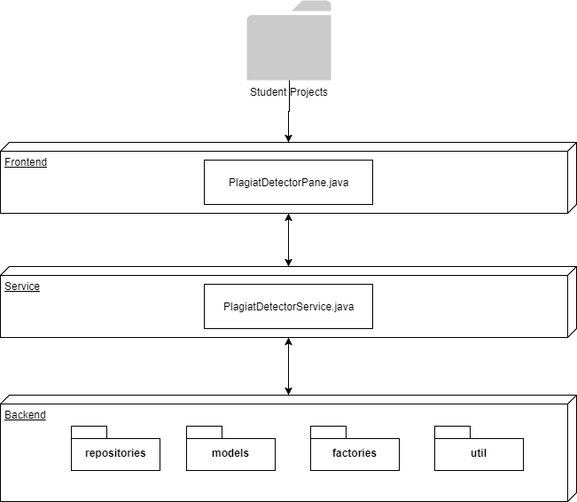

# Plagiat Detector

## Introduction
This project was created for the "Efficient Algorithms" (efalg) course at University of Applied Sciences and Arts Northwestern Switzerland FHNW.

### Goal
The goal of this project is to study, learn and apply different techniques for source code plagiarism detection and come
up with a program that can be used by professors for plagiarism detection between students at a school for a specific project or homework.
## Usage
### Preparation
Create a folder containing all the projects that shall be checked for plagiarism, e.g.:
- C:/StudentProjects
  - StudentA
    - ProjectX
      - src
        - java
          - MyApp.java
          - SomeClass.java
          - ...
  - StudentB
    - ProjectX
      - ...
  - StudentC
    - ...
  - ...
### Running the program
- Run PlagiatDetectorMain.java
- Input the path to the folder creating in previous step
- Click OK
- Similarity between all the projects will be calculated and displayed in a similarity matrix

## Software Architecture

## Concept/Functionality
There are many different approaches for detecting plagiarism in source code. Also it is hard to define when a plagiat
is really a plagiat and when it is not. If two applications are supposed to do the same thing, some part of 
the program will most likely be similar, regardless if it is a plagiat or not.

### How are plagiats made?
To find out what students would most likely do when plagiarizing a software project, I asked around a bit. The most common
answers were:
- changing variable names
- adding/removing/modifying comments
- re-ordering statements
- splitting up code in different classes or merging several classes into one

These things are all quite easy to do, even if you have no idea what the program that you are plagiarizing does, so these
are certainly things that people who plagiarize source code will do.
So this application will focus on these points.

### Approach
In my Datamining course at Seoul National University I learned a lot of theory about document similarity but never got the change
to actually apply it. So I took this chance and decided to write a plagiarism detector using a document similarity approach.
The idea goes as follows:

Every source code folder will be represented as a single document. This document will be split up into k-shingles (a k-tupel consisting of k tokens).
Tokens are generated by splitting up the sourcecode by whitespaces.
Let me illustrate this process for a simple sentence:

Document = "hello, my name is patric"
Tokens = { "hello", "my", "name", "is", "patric" } 
Shingles (k=3) = { "hello my name", "my name is", "name is patric" }

#### ShingleRepository
Every document is processed like this 

## Advantages

## Disadvantages

## Experiments

### Parameters

### Test Data

### Results

### Discussion

## Expandability

## Conclusion

## References
