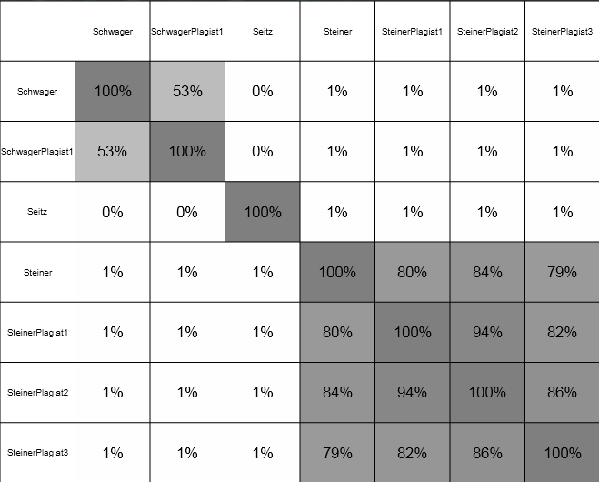

# Plagiat Detector

## Introduction
This project was created for the "Efficient Algorithms" (efalg) course at University of Applied Sciences and Arts Northwestern Switzerland FHNW.

### Goal
The goal of this project is to study, learn and apply different techniques for source code plagiarism detection and come
up with a program that can be used by professors for plagiarism detection between students at a school for a specific project or homework.
## Usage
### Preparation
Create a folder containing all the projects that shall be checked for plagiarism, e.g.:
- C:/StudentProjects
  - StudentA
    - ProjectX
      - src
        - java
          - MyApp.java
          - SomeClass.java
          - ...
  - StudentB
    - ProjectX
      - ...
  - StudentC
    - ...
  - ...
### Running the program
- Run PlagiatDetectorMain.java
- Input the path to the folder creating in previous step
- Click OK
- Similarity between all the projects will be calculated and displayed in a similarity matrix

## Software Architecture
The software is built using a very straight-forward 3-layer architecture:

## Concept/Functionality
There are many different approaches for detecting plagiarism in source code. Also it is hard to define when a plagiat
is really a plagiat and when it is not. If two applications are supposed to do the same thing, some part of 
the program will most likely be similar, regardless if it is a plagiat or not.

### How are plagiats made?
To find out what students would most likely do when plagiarizing a software project, I asked around a bit. The most common
answers were:
- changing variable names
- adding/removing/modifying comments
- re-ordering statements
- splitting up code in different classes or merging several classes into one

These things are all quite easy to do, even if you have no idea what the program that you are plagiarizing does, so these
are certainly things that people who plagiarize source code will do.
So this application will focus on these points.

### Approach
In my Datamining course at Seoul National University I learned a lot of theory about document similarity but never got the chance
to actually apply it. So I took this opportunity now and decided to write a plagiarism detector using a document-similarity approach.
The idea goes as follows:

Every source code folder will be represented as a single document. This document will be split up into k-shingles (a k-tupel consisting of k tokens).
Tokens are generated by splitting up the sourcecode by whitespaces.
Let me illustrate this process for a simple sentence:

Document = "hello, my name is patric"
Tokens = { "hello", "my", "name", "is", "patric" } 
Shingles (k=3) = { "hello my name", "my name is", "name is patric" }

If we compared documents by using only tokens, much information of the document would be lost and would not contribute to
the similarity.
But by using shingles instead of raw tokens for comparison, there is the advantage that the order of the tokens will still be
taken into account while comparing documents.

#### ShingleRepository
All the shingles of all the documents are stored in a sinlge repository, which assigns an integer (id) to every shingle.
By doing this, every document can basically be represented by a binary vector that has the length of the total amount of shingles
in the repository. The value at position i of the vector is 1 if the document contains shingle i and 0 otherwise.
This allows us to do a very simple comparison between documents, by just comparing position by position and checking for equality.

Note: programmatically we can obviously use another data structure than an array of length of total shingles, e.g. a set of integers to save memory.

#### Similarity
When every document is represented by a binary vector, documents can be compared using the jaccard-similarity, which is defined as
the size of the intersection divided by the size of the union of the documents, which will always be a value between 0 and 1 inclusive.
Example:

ShinlgeId:    1 2 3 4 5 6 7
Document1:    0 0 1 1 0 1 0
Document2:    0 0 1 0 1 1 0

Intersection: 0 0 1 0 0 1 0
Union:        0 0 1 1 1 1 0

Jaccard similarity: 2/4 = 0.5

#### Preprocessing
To get a more accurate result, all the documents are preprocessed with the aim that all changes to the original document
by the person plagiarizing are disregarded (as good as possible).

Things that are done in preprocessing includes:
- renaming all variables and methods
- removing import statements, comments certain modifiers
- removing indentation and unnecessary spaces
- converting number types to either int or double

This way we get rid of many of many things people do to plagiarize source code and can achieve a more accurate comparison result.

## Advantages

## Disadvantages

## Experiments

### Test Data
To test the application I used the "NonogramSolver" (a previous homework of this course) of three different students.
All of these 3 Applications do the same thing - solve a nonogram - but are written independently and are certainly not plagiarisms.

Additionaly, I took some of these 3 homeworks and created different plagiarisms for them, by doing some of combinations
of the things mentioned in "How are plagiats made?".

### Parameters
There are several parameters that can be adjusted. First of all, we can enable or disable certain preprocessing functions.
By doing experiments with different functions turned on and off, it turns out that it makes the most sense to turn them all on
(as expected, because this way we can disregard as many of the plagiarism techniques as possible with losing only minimal information).

The far more important parameter is the TOKENS_PER_SHINGLE. Setting it to 1 will just do a token-wise comparison between documents.
Chances are high, that we get some matches (although only low similarities, but still), even if the documents are certainly not plagiarisms.

The higher the value is set, the "stricter" the plagiarism checker is. Setting it to a value between 5 and 15 yields very good results.
By setting it to 10, we get these results:

### Discussion

As we can see, even though we know for sure that two programs are plagiarisms, the similarity can be as low as around 50%.
However, for all the documents that we know are not plagiarisms, the similarity is either 0 or 1%, which is extremely accurate.
This means that even a similarity as low as 30% can be an indicator for plagiarism and is worth looking into.

## Expandability
The document-similarity approach I used can very well be expanded for extremely large datasets. We could use the technique of
[MinHashing](https://en.wikipedia.org/wiki/MinHash) for example and thus further reduce the size of the documents while only
losing minimal information.

## Failed approaches
Initially I planned to also compare documents by using metrics like:
- amount of public/private/protected/final modifiers
- amount of files/classes/packages/imports
- ...

I tried using these kinds of metrics and included them in the effective similarity calculation. It turns out however, that they only
have a minimal impact on the end result, so I discarded this idea again and removed them from the calculation.

## Conclusion
It was interesting to finally have a hands-on project where I could use techniques that I previously learned - even if this
project is probably not as well suited for the document-based similarity approach as I initially thought it would be.

## References
Datamining course at Seoul National University, Spring 2017, Professor U Kang](https://datalab.snu.ac.kr/~ukang/courses/17S-DM/),
especially [this slide set](https://datalab.snu.ac.kr/~ukang/courses/17S-DM/L5-lsh.pdf)